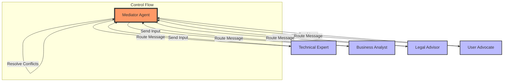
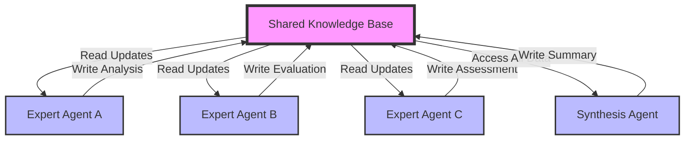

MORE DIAGRAMS

---

### Mediated Collaboration Pattern Diagram

```mermaid
graph TD
    MA[Mediator Agent]
    TE[Technical Expert]
    BA[Business Analyst]
    LA[Legal Advisor]
    UA[User Advocate]
    
    TE -->|Send Input| MA
    BA -->|Send Input| MA
    LA -->|Send Input| MA
    UA -->|Send Input| MA
    
    MA -->|Route Message| TE
    MA -->|Route Message| BA
    MA -->|Route Message| LA
    MA -->|Route Message| UA
    
    MA -->|Manage Turn| MA
    MA -->|Resolve Conflicts| MA
    
    subgraph Control Flow
    MA
    end
    
    classDef mediator fill:#f96,stroke:#333,stroke-width:4px
    classDef expert fill:#bbf,stroke:#333,stroke-width:2px
    class MA mediator
    class TE,BA,LA,UA expert
```
---

### Collaborative Model Pattern Diagram

```mermaid
graph TD
    KB[Shared Knowledge Base]
    EA[Expert Agent A]
    EB[Expert Agent B]
    EC[Expert Agent C]
    SA[Synthesis Agent]
    
    EA -->|Write Analysis| KB
    EB -->|Write Evaluation| KB
    EC -->|Write Assessment| KB
    KB -->|Read Updates| EA
    KB -->|Read Updates| EB
    KB -->|Read Updates| EC
    KB -->|Access All Data| SA
    SA -->|Write Summary| KB

    classDef kb fill:#f9f,stroke:#333,stroke-width:4px
    classDef agent fill:#bbf,stroke:#333,stroke-width:2px
    class KB kb
    class EA,EB,EC,SA agent
```
